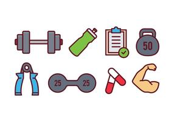
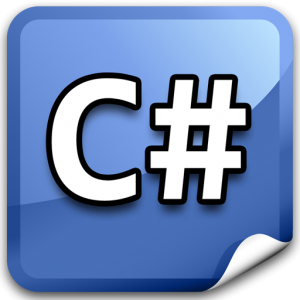
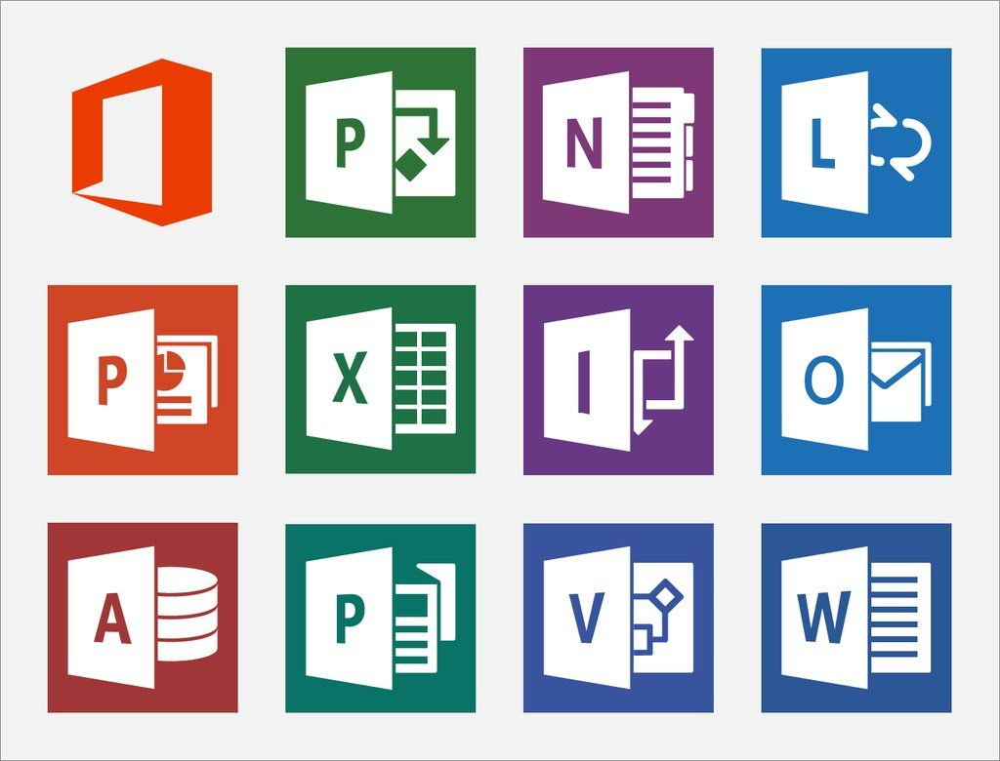
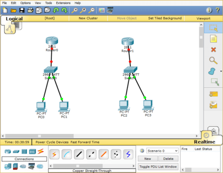

<html lang="en">
<head>
    <link rel="stylesheet" href="content stylesheet.css">
    <link rel="stylesheet" href="Nav&Logo Stylesheet.css">
    <link rel="stylesheet" href="about.css">
    <link rel="stylesheet" href="interests.css">
    <link rel="stylesheet" href="skills.css">
    <link rel="stylesheet" href="contact.css">
    <link rel="stylesheet" href="responsive.css">
   <link rel="stylesheet"  href="https://cdnjs.cloudflare.com/ajax/libs/font-awesome/4.7.0/css/font-awesome.min.css">
   <link rel="shortcut icon" type="image/png" href="SamboFavBar.png"/>
   
   <title>TshiphiwaSambo</title>

    <!-- Auto resize % of text as window scales. -->
    <meta name="viewport" content ="width=device-width,initial-scale=1.0,user-scalable=yes">

   
</head>

<body>
    <!-- -------------------------Navigation------------------------------- ----- -->

    
    

    

        <ul>
            <li><a href="#home">Home</a></li>
            <li><a href="#about">About</a></li>
            <li><a href="#interests">Interests</a></li>
            <li><a href="#skills">Skills</a></li>
            <li><a href="#contact">Contact</a></li>
        </ul>
    

    
    

    

        <h1>I am TSHIPHIWA SAMBO</h1>
        
And this is my resume

        <a href = "#about">
            <input type="button" value ="Get to know me"/>
        </a>

        

        

            
            
            
        

    

    
<!-- -------------------------About------------------------------------ -->

<section class="about" id="about">
    

    <h2>About Me</h2>
    

    

    
    

    

        <h3> Vision– To advance my IT skills in order to benefit and help my community.</h3>
        
I am a final year IT student who is a very hard worker and always find easy ways of solving problems.  
            I am a person who focuses more on finding solutions instead of more problems.  
            I have the ability to overview and manage complex tasks and the ability to motivate and coach a team in order to achieve the desired goal.  
            I am also a team player who can work with people from different cultural backgrounds.  
            I am also part of the Golden Key International Society.
        

        

    

</section> 

<!-- -------------------------Interests------------------------------------ -->

<section class = "Interests" id="interests">
    

        <h2>Interests</h2>
        

        
This is all my I am interested in outside my course

    

    

    

    
    <h2>Coding</h2>
    
 I usually do all of this when I'm bored or I have some crazy idea in my head to implement

    
    <h2>Hiking</h2>
    
 I always used to do this in my high school year, it was the best thing ever!

    
    <h2>Travelling</h2>
    
 Travelling helps me to meet new people out there in the world and learn new cultures and taste different kinds of food

    
    <h2>Listening to music</h2>
    
 I love doing this the most in my spare time

    
    <h2>Gym</h2>
    
 I do this almost every single day in my room during my study breaks

    
    <h2>Gardening</h2>
    
 I do this during weekends to help me clear my mind and focus on the beauty of nature

</section>

<!-- ------------------------Technical Skills---------------------------------------- -->

 <section class="skills" id="skills">
    

        <h2>My Technical Skills</h2>
        

        
This is just a brief summary of my tech skills, more to come!!!!

    

    

        
        <h2>Java Programming</h2>
    

     

        
        <h2>C#</h2>
    
 

    

        
        <h2>Python Programming</h2>
    

    

        
        <h2>Statistics</h2>
    

    

        
        <h2>Data Analytics</h2>
    

    

        
        <h2>MS Office</h2>
    

    

        
        <h2>Database Design</h2>
    

    

        
        <h2>Front-End Web Development</h2>
    

    

        
        <h2>Networking (Cisco routers & switches)</h2>
    

</section> 
 

<!-- -------------------------Contacts------------------------------------>
<section class ="contacts" id= "contact">
    

        <h2>Wanna reach me directly?</h2>
        

        
Just use the details below

    

    

        <i class="card-icon fa fa-envelope"></i>
        <h3>Email Address</h3>
        
Tshiphiwa@hotmail.co.za

    

    

        <i class="card-icon fa fa-phone"></i>
        <h3>Phone Number</h3>
        
072 672 7111

    

    

        <i class="card-icon fa fa-map-marker"></i>
        <h3>Location</h3>
        
Gauteng, South Africa

    

</section>

<!-- -------------------------Contact & formbox------------------------------------ -->

<section class="contact" id="Contact">

    <form action="MAILTO:Tshiphiwa@hotmail.co.za" method="POST" enctype="text/plain">
    <form>
        <h3>Please fill in the form</h3>
        <input type = "text" name="" placeholder="Full name" required>
        <input type = "text" name="" placeholder="Email" required>
        <input type = "text" name="" placeholder="Cell Number">
        <textarea placeholder="Your message here"></textarea>
        <input type="submit" value="send">
    </form>
</form>

    

</section>

</body>

<!-- -------------------------Footer------------------------------------>
<footer>
    <a class="scrollup" href="#"><i class ="fas fa-arrow-up"></i></a>

    

    
 Copyright &copy; Tshiphiwa Sambo Resume. | All rights reserved.|

    <a href="https://www.facebook.com/tshiphiwa.sambo1/"><i class = "icon fa fa-facebook"></i></a>
    <a href="https://www.instagram.com/tshiphiwa_s/?hl=en"><i class = "icon fa fa-instagram"></i></a>
    <a href="https://twitter.com/Tshiphiwa24"><i class = "icon fa fa-twitter"></i></a>
    <i class = "icon fa fa-linkedin"></i>

</footer>

</html>

<!-- -------------------------JS Code------------------------------------ -->

<!-- Code for the sticky navbar -->

